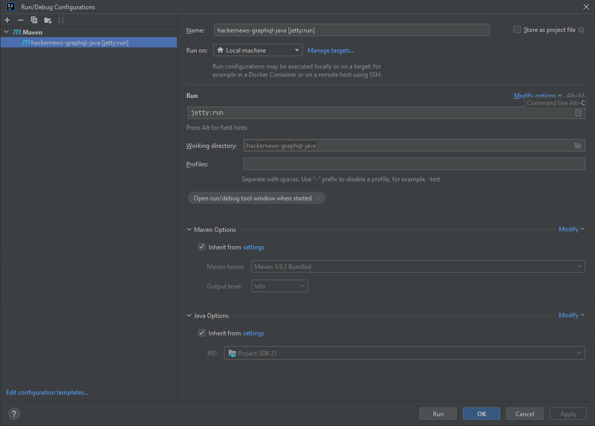

# GraphQL Tutorial
This document create a service which implements GraphQL to manage the Links and Users.

[Reference Tutorial](https://www.howtographql.com/graphql-java/0-introduction/)

Functionalities in this tutorial include:

1. Query
2. Mutation
3. Authentication
4. Error Handling
5. Filtering
6. Pagination

This implementation is based on Jetty and Java 21. To start up the server, use the following maven command:

```agsl
mvn jetty:run
```

IntelliJ Run Configuration:
